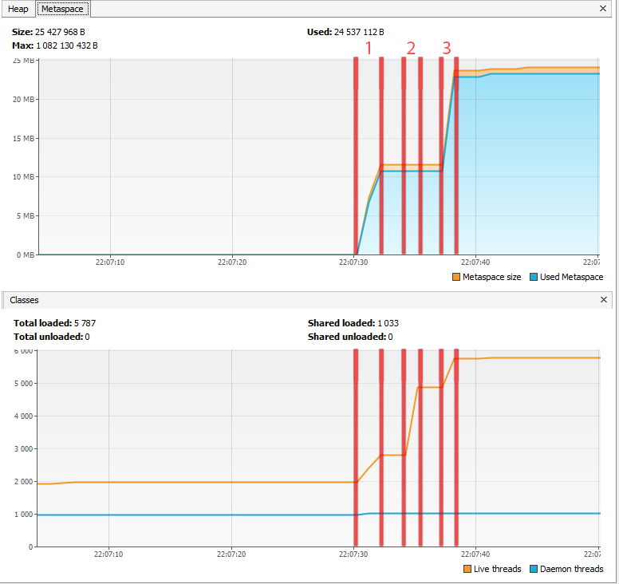
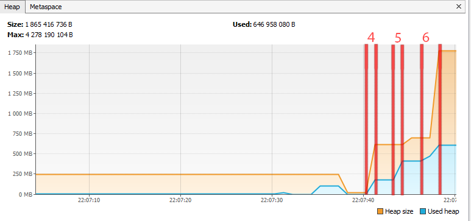

1. Загрузка классов io.vertx в область Metaspace.
1. Загрузка классов io.netty в область Metaspace.
1. Загрузка классов org.springframework в область Metaspace.


1. Создание 5_000_000 объектов.
1. Создание второй партии объектов.
1. Создание третьей партии.



Между загрузками и созданием объектов пауза 3 секунды,
поэтому объем занятой памяти не меняется. Также на графиках видно
как выделенный размер кучи увеличивается по достижении определённых значений занятой памяти.


````
22:07:31.085438500: loading io.vertx
22:07:31.293880100: loaded 529 classes
22:07:34.296982600: loading io.netty
22:07:34.641034600: loaded 2117 classes
22:07:37.642008: loading org.springframework
22:07:37.798568: loaded 869 classes
22:07:40.800959100: now see heap
22:07:40.800959100: creating 5000000 objects
22:07:41.025861700: created
22:07:44.028208200: creating 5000000 objects
22:07:44.148798700: created
22:07:47.205585200: creating 5000000 objects
22:07:47.335151700: created
````
